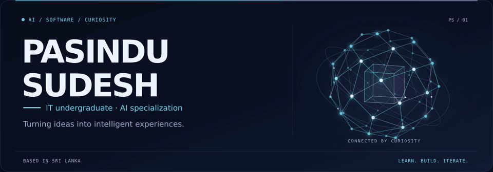
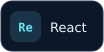
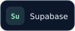

<!--
  Pasindu Sudesh / Aurora profile theme
  Upload README.md AND the complete assets folder to the repository root.
  Static header option: replace ./assets/hero.gif with ./assets/hero-static.svg.
-->

  

<h1 align="center">Hey, I'm Pasindu 👋</h1>

  <strong>IT Undergraduate &nbsp;·&nbsp; AI &amp; ML Enthusiast &nbsp;·&nbsp; Software Developer</strong>
   
  BSc (Hons) in Information Technology — Artificial Intelligence
   
  🇱🇰 Sri Lanka

  <em>A curious mind, a love for technology, and a little creativity.</em>

  <a href="#a-little-about-me">About me</a> &nbsp; ✦ &nbsp;
  <a href="#my-toolkit">My toolkit</a> &nbsp; ✦ &nbsp;
  <a href="#lets-connect">Let's connect</a>

## A little about me

I'm **Pasindu Sudesh**, an Information Technology undergraduate from Sri Lanka specializing in **Artificial Intelligence**. I enjoy understanding how intelligent systems work and using technology to solve everyday problems.

- 🧠 **My interests:** Artificial Intelligence, Machine Learning and intelligent agents.
- 💻 **What I enjoy:** Exploring web and mobile development, and turning ideas into useful software.
- 🌱 **My mindset:** Keep learning, stay curious and improve a little every day.

> Creativity meets code. Curiosity keeps it moving.

## My toolkit

### Languages

  
    Python
  
  
    FastAPI
  
  
    Java
  
  
    JavaScript
  
  
    C
  
  
    HTML
  
  
    CSS
  

### Web &amp; mobile

  
    React
  
  
    React Native
  
  
    Node.js
  
  
    Tailwind CSS
  

### AI &amp; data

  
    TensorFlow
  
  
    MongoDB
  
  
    Supabase
  
  
    MySQL
  
  
    SQL Server
  

### Developer tools

  
    Git
  
  
    GitHub
  
  
    VS Code
  

## Let's connect

  Let's connect, share ideas and learn from one another.

  
  &nbsp;
  
  &nbsp;
  
  &nbsp;
  

 

  

