<!--
  ╔══════════════════════════════════════════════════════════════╗
  ║  Pasindu Sudesh · "Neural Midnight" GitHub Profile          ║
  ║  Theme: Dark, futuristic, AI-focused                        ║
  ║  Search for "EDIT HERE" to find all customizable fields      ║
  ╚══════════════════════════════════════════════════════════════╝
-->

<!-- ==================== HERO BANNER ==================== -->

  

<!-- ==================== TYPING ANIMATION ==================== -->
<!-- EDIT HERE: Change the lines below to match your focus areas -->

  

<!-- ==================== BADGES ==================== -->

  <!-- EDIT HERE: Replace kmpasindusudesh with your GitHub username -->
  
  &nbsp;
  
  &nbsp;
  

<!-- ==================== DIVIDER ==================== -->

<!-- ==================== MODEL CARD — ABOUT ==================== -->
<h2 align="center">🧬 Model Card</h2>

<table align="center">
  <tr><td><strong>Model</strong></td><td>Pasindu Sudesh</td></tr>
  <!-- EDIT HERE: Replace degree and university -->
  <tr><td><strong>Architecture</strong></td><td>BSc (Hons) IT — Artificial Intelligence, SLIIT</td></tr>
  <tr><td><strong>Trained on</strong></td><td>Python, ML, DL, Computer Vision, real-world projects</td></tr>
  <!-- EDIT HERE: Replace fine-tuned focus -->
  <tr><td><strong>Fine-tuned for</strong></td><td>Computer Vision · NLP · Intelligent Agents</td></tr>
  <tr><td><strong>Inference speed</strong></td><td>Fast learner · ships code that works</td></tr>
  <tr><td><strong>Status</strong></td><td>✅ Open to internships &amp; collaborations</td></tr>
</table>

<!-- EDIT HERE: Write 2-3 lines about yourself -->

  I'm an Information Technology undergraduate from Sri Lanka specializing in <strong>Artificial Intelligence</strong>. 
  I build ML-powered projects that solve real problems — from image classifiers to NLP pipelines. 
  I believe in learning by building, sharing knowledge, and writing clean, documented code.

<!-- ==================== TERMINAL CARD ==================== -->

  

<!-- ==================== DIVIDER ==================== -->

<!-- ==================== CURRENTLY ==================== -->
<h2 align="center">⚡ Currently</h2>

<!-- EDIT HERE: Update what you're working on -->

  🔬 <strong>Learning:</strong> Transformer architectures, advanced computer vision 
  🛠️ <strong>Building:</strong> AI-powered tools and ML research projects 
  🤝 <strong>Looking for:</strong> Internships, research collaborations, open-source contributions

<!-- ==================== TECH STACK ==================== -->
<h2 align="center">🛠 Tech Stack</h2>

<strong>Languages</strong>

  

<strong>AI / Machine Learning</strong>

  

  
  
  

<strong>Tools &amp; Platforms</strong>

  

  
  
  

<!-- ==================== TRAINING PROGRESS ==================== -->

  

<!-- ==================== DIVIDER ==================== -->

<!-- ==================== FEATURED PROJECTS ==================== -->
<h2 align="center">🚀 Featured Projects</h2>

<table align="center">
  <tr>
    <td align="center" width="320">
      <!-- EDIT HERE: Replace with your project 1 details and repo URL -->
      <h3>Project One</h3>
      
<em>Solved X problem using deep learning for Y use case</em>

      
      
        
      
    </td>
    <td align="center" width="320">
      <!-- EDIT HERE: Replace with your project 2 details and repo URL -->
      <h3>Project Two</h3>
      
<em>Built an ML pipeline for automated data classification</em>

      
      
        
      
    </td>
    <td align="center" width="320">
      <!-- EDIT HERE: Replace with your project 3 details and repo URL -->
      <h3>Project Three</h3>
      
<em>NLP-based tool for intelligent text summarization</em>

      
      
        
      
    </td>
  </tr>
</table>

<!-- ==================== GITHUB STATS ==================== -->
<h2 align="center">📊 GitHub Stats</h2>

<!-- EDIT HERE: Replace kmpasindusudesh with your username if different -->

  
  &nbsp;
  

  

<!-- ==================== CONTRIBUTION SNAKE ==================== -->

  <picture>
    <source media="(prefers-color-scheme: dark)" srcset="https://raw.githubusercontent.com/kmpasindusudesh/kmpasindusudesh/output/github-snake-dark.svg" />
    <source media="(prefers-color-scheme: light)" srcset="https://raw.githubusercontent.com/kmpasindusudesh/kmpasindusudesh/output/github-snake.svg" />
    
  </picture>

<!-- ==================== ACTIVITY GRAPH ==================== -->

  

<!-- ==================== DIVIDER ==================== -->

<!-- ==================== CONNECT ==================== -->
<h2 align="center">🌐 Let's Connect</h2>

<!-- EDIT HERE: Replace all URLs with your actual profile links -->

  
  &nbsp;
  
  &nbsp;
  
  &nbsp;
  

<!-- ==================== QUOTE ==================== -->

  <em>"The best way to predict the future is to build it."</em>

<!-- ==================== FOOTER ==================== -->

  

