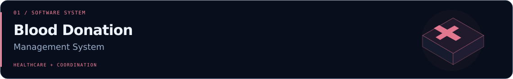
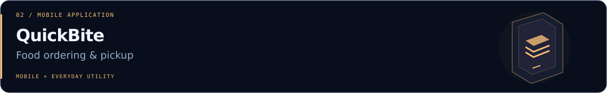
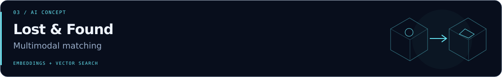

<!--
  PROFILE THEME: Neural / Midnight
  Upload this README.md together with the assets folder to your profile repository.
  For a still header, replace ./assets/hero.gif with ./assets/hero-static.svg.
-->

  

<h1 align="center">Hi, I'm Pasindu Sudesh 👋</h1>

  <strong>IT Undergraduate &nbsp;·&nbsp; AI &amp; ML Enthusiast &nbsp;·&nbsp; Software Developer</strong>
   
  BSc (Hons) in Information Technology — Artificial Intelligence
   
  🇱🇰 Sri Lanka

  
  &nbsp;
  

  <a href="#about-me">About</a> &nbsp; / &nbsp;
  <a href="#tech-stack">Tech stack</a> &nbsp; / &nbsp;
  <a href="#featured-projects">Projects</a> &nbsp; / &nbsp;
  <a href="#currently-exploring">Learning</a> &nbsp; / &nbsp;
  <a href="#github-activity">Activity</a>

---

## About me

I'm an **Information Technology undergraduate specializing in Artificial Intelligence**, interested in building practical software and AI-powered applications. I enjoy connecting what I learn in AI with the web and mobile applications I build.

- **My focus:** Artificial Intelligence, Machine Learning and Agentic AI.
- **What I enjoy:** Turning real-world problems into useful software.
- **What I'm developing:** My skills in AI/ML, full-stack development and software engineering.
- **Open to:** Learning, collaboration and internship opportunities.

> Curious about how intelligent systems work. Motivated by what they can help people do.

## Tech stack

### Languages

  
  
  
  
  
  

### Web &amp; mobile development

  
  
  
  

### AI, data &amp; databases

  
  
  
  
  

### Developer tools

  
  
  

## Featured projects

### Blood Donation Management System

  

A software system for coordinating blood donation activities, from donor registration to blood inventory and notifications.

**Key areas:** Donor registration · Blood inventory · Notifications  
**Built with:** `Java` `HTML` `Tailwind CSS` `SQL Server`

### QuickBite

  

A mobile application for food ordering and pickup, with notifications and ratings to support the ordering experience.

**Key areas:** Food ordering · Pickup · Notifications · Ratings  
**Built with:** `React Native` `Node.js` `MongoDB`

### AI-Powered Lost &amp; Found Matching

  

An **AI concept** for matching lost and found wallet records by combining image and text embeddings with vector similarity search.

**Concept flow:** Image + text → Embeddings → Similarity search → Candidate matches  
**Exploring:** `Multimodal AI` `Embeddings` `Vector Search` `Machine Learning`

  <a href="https://github.com/kmpasindusudesh?tab=repositories"><strong>Explore my repositories ↗</strong></a>

## Currently exploring

| Area | Learning focus |
| :--- | :--- |
| **AI & Machine Learning** | Understanding how models learn and how to apply them to practical problems. |
| **Intelligent & Agentic AI** | Exploring agents, reasoning, planning and coordinated workflows. |
| **Large Language Models** | Learning how language models can support useful applications. |
| **Embeddings & Vector Databases** | Exploring semantic similarity, multimodal matching and retrieval. |
| **Full-Stack Development** | Improving the connections between interfaces, services and data. |

## GitHub activity

  
<strong>View my GitHub stats, languages &amp; contribution streak</strong>

   
  

    
    
  

  

    
  

  
Cards are provided by external services and may be temporarily unavailable. Language statistics describe repositories, not proficiency.

## Let's connect

I'm open to **collaboration, learning opportunities and internships** in AI and software development.

Have an interesting idea or a project to discuss? Find me on [LinkedIn](https://www.linkedin.com/in/pasindu-sudesh-3b18a8374/) or explore what I'm building on [GitHub](https://github.com/kmpasindusudesh).

 

  

